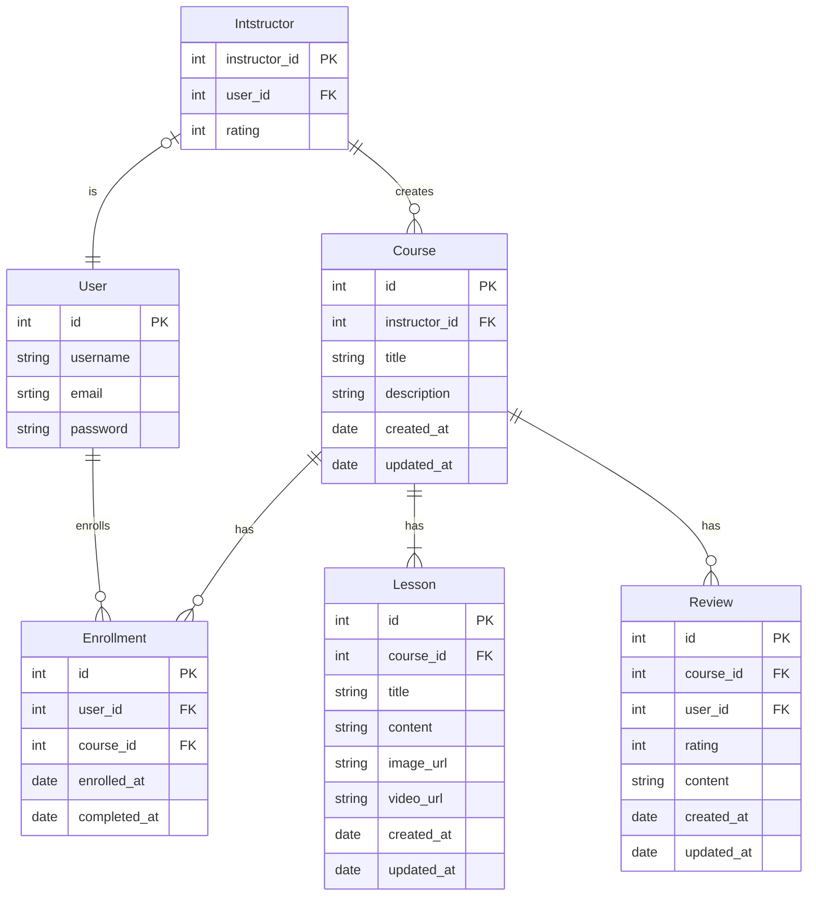

# Online Learning Platform

The Online Learning Platform is a application that provides a platform for users to access educational content, enroll in courses, and track their learning progress. It allows instructors to create and manage courses, interact with students, and provide assessments and feedback.

## Table of Contents

- [Technologies](#technologies)
- [ERD](#erd-entity-relationship-diagram)
- [Feature Checklist](#feature-checklist)
- [Installation](#installation)
- [Docker](#docker)
- [Usage](#usage)
- [Contributing](#contributing)

## Technologies

This project utilizes the following technologies:

- [TypeScript](https://https://www.typescriptlang.org) - A typed superset of JavaScript that compiles to plain JavaScript
- [NestJS](https://nestjs.com) - A progressive Node.js framework for building efficient, scalable, and maintainable server-side applications.
- [PostgreSQL](https://www.postgresql.org/) - A powerful, open-source relational database management system.
- [TypeORM](https://typeorm.io/) - An ORM (Object-Relational Mapping) library for TypeScript and JavaScript that simplifies database integration.
- [Docker](https://www.docker.com/) - A platform for automating the deployment and management of applications using containerization.

## ERD (Entity-Relationship Diagram)



## Feature Checklist

1.  Authentication:
    - [x] Login and signup functionality with JWT authentication.
2.  User Profile:

    - [x] Ability to retrieve user profile information.

3.  Instructor Registration:

    - [x] Register as an instructor to create and manage courses.

4.  Instructor Courses:

    - [x] Retrieve all courses created by an instructor.

5.  Course Management:

    - [x] CRUD (Create, Read, Update, Delete) functionality for courses with proper authorization.
    - [x] Only authorized instructors can perform course management actions.

6.  Lesson Management:

    - [x] CRUD functionality for lessons within a course.
    - [x] Ability to upload and store images and videos for lessons (using Cloudinary).
    - [ ] Only users enrolled in a course can access the lessons within that course.

7.  User Enrollment:

    - [ ] Allow users to enroll in courses.

8.  Course Reviews:

    - [ ] Enable users to leave reviews for courses.

9.  Instructor Reviews:

    - [ ] Enable users to leave reviews for instructors.

## Installation

1. Clone the repository
2. Install dependencies using pnpm (preferred):
   ```bash
   $ pnpm install
   ```
   Note: If pnpm is not installed, you can install it globally by running `npm install -g pnpm`. Alternatively, you can use npm by running `npm install.`
3. Set up the environment variables. Update the .env.dev values as required.

## Setup PostgreSQL

1. Install PostgreSQL on your local machine or set up a remote PostgreSQL server.
2. Create a new PostgreSQL database for the project.
3. Update the .env.dev file with the following information:
   ```
     DB_HOST=<postgres-host>
     DB_PORT=<postgres-port>
     DB_USERNAME=<postgres-username>
     DB_PASSWORD=<postgres-password>
     DB_NAME=<postgres-database-name>
   ```

## Usage

1. Start the development server:

   ```
   $ pnpm start:dev
   ```

2. Open a web browser and navigate to `http://localhost:<port>` to access the application.

## Docker

To run the project using Docker Compose, make sure you have Docker and Docker Compose installed on your system. Then, follow these steps:

1. Build and start the Docker containers:

```
  $ pnpm docker:compose:up
```

2. Open a web browser and navigate to `http://localhost:<port>` to access the application.

## Contributing

If you want to contribute to a project and make it better, your help is very welcome.

1. Fork the repository.
2. Create a new branch: `git checkout -b feature/my-feature`.
3. Make changes and commit them: `git commit -m 'feat: Add some feature'`.
4. Push the changes to your forked repository: `git push origin feature/my-feature.`
5. Submit a pull request detailing your changes.
